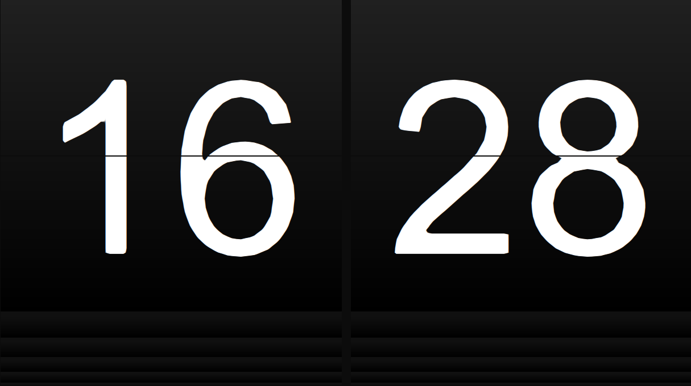
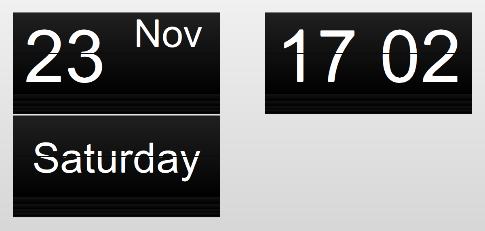

# FlapQML

[](https://www.gnu.org/licenses/gpl-3.0) [](https://github.com/ChristianVisintin/FlapQML) [](https://github.com/ChristianVisintin/FlapQML/issues)


Developed by *Christian Visintin*  
Version **2.4.0** ~ 27/06/2020


---

- [FlapQML](#flapqml)
  - [Introduction 🚀](#introduction-)
  - [Implementation 🎯](#implementation-)
  - [Documentation 📚](#documentation-)
    - [Flap](#flap)
    - [flip](#flip)
    - [setFlap](#setflap)
  - [Examples 🧧](#examples-)
  - [Changelog 🕒](#changelog-)
  - [Gallery 🎬](#gallery-)
  - [Buy me a coffee ☕](#buy-me-a-coffee-)
  - [License 📜](#license-)

---

## Introduction 🚀

FlapQML is a component for QtQuick applications which can be used to create flapboards, flipclocks and other flap-related stuff.
The component Flap represents a single Flap, which can then be used with other flaps (in a grid for example) to create a board.
These are the main FlapQML features:

- Fully customizable Flap
  - Sizes
  - Font
  - Color
  - Rotation speed
  - Radius
  - Text alignment and position
- Built-in rotate function

---

## Implementation 🎯

To implement FlapQML you need to include Flap.qml in your project first, then you can instantiate a flap in this way

```qml

Flap {

id: myFlap;
flapWidth: 128; //Width of the flap component
flapHeight: 196; //Height of the flap component
flapSequence: ['0','1','2','3','4','5','6','7','8','9'] //is the sequence of strings/characters the flap can display
flapTextPosition: textPosition_Middle; //Text position in flap
flapTextAlignment: Text.AlignHCenter;
flapRadius: 0; //No angle smooth
flapFontSize: 164; //Font size in pixel of the text on the flaps
property string flapFontFamily: "Helvetica"; //Family font of the text on the flap
property string flapText: " "; //Text displayed by default on the flap
property int flapAnimDuration: 80; //Duration in milliseconds of the flip animation
property string brightColor: "#303030"; //Color of the upper part of the upper flap
property string midColor: "#101010"; //color of the lower part of the upper flap and the color of the upper part of the lower flap
property string darkColor: "#000000"; //Color of the lower part of the lower flap
property string textColor: "white"; //Text color of the flap text
property string backgroundColor: "#0c0c0c"; //Background color
}
```

Once a flap has been instantiate, to flip it, all you have to do is to call **flip** function in this way

```qml
myFlap.flip(newChar, force)
```

---

## Documentation 📚

These are the properties supported by the Flap component.

### Flap

- **flapWidth**: Total width of the Flap component in pixel
- **flapHeight**: Height of a Flap.
- **flapSequence**: The sequence of characters or string the flap has. It should be used as an array of strings. If a string is provided it will be split into an array of characters.
- **flapPlain**: If set to false, the "previous" flaps will be visible as shown in the image ["Clock"](#clock) in the gallery. When this option is set to false, the flap height will be lower, in order to reserve space for the previous flaps.
- **flapTextPosition**: Describes whether the text must be placed on the upper flap section, on the lower flap section or as usual in the middle. (Default: Middle)
- **flapTextAlignment**: Describes the horizontal text alignment of the flap's text in the flap. (Default: Text.AlignHCenter)
- **flapRadius**: Describes the optional *radius* for the flap, which smooths the angles of the flap.
  - The usable values are: *textPosition_Top*, *textPosition_Middle*, *textPosition_Bottom*
- **flapFontSize**: Pixel size of the Flap text. Consider to set it about flapHeight * 1.4
- **flapFontFamily**: the font family used by the Flap component. The original font used by the Solari board is very similiar to Helvetica, so I suggest you going with that.
- **flapText**: The current flap text. It changes when you flip the component.
- **flapBold**: If true, the text on the flap will be bold.
- **flapAnimDuration**: the duration of a flip animation in milliseconds.
- **brightColor**: Color of the upper part of the flip gradient.
- **midColor**: Color of the middle part of the flip gradient.
- **darkColor**: Color of the lowest part of the flip gradient.
- **backgroundColor**: Background color applied to the little rectangle between the flaps.

### flip

The flip function allows to flip the flap through its char sequence until the specified character is found. If force is true, if the current character is the same of the new character, a full rotation will be performed through the entire char sequence.

```qml
flip(newChar, force)
```

- **newChar**: the new character the flap will display
- **force**: normally if the currently displayed character is the same of newChar the flap won't move. If set to true will force the flap to flip anyway

### setFlap

The setFlap functions force the text of a flap without animating the flap itself. The provided string MUST be in the flapSequence.

```qml
setFlap(text)
```

- **text**: the new displayed text
If text is not in the flap sequence false is returned, otherwise it returns true.

---

## Examples 🧧

This repository comes with an example applications, which contains 3 pratical examples:

- Flapbord: basically a 8x3 flapboard
- Clock: a split-flap clock inspired by Solari Cifra 3
- Calendar: a split-flap clock inspired by Solari Dator 60

---

## Changelog 🕒

See changelog [HERE](./CHANGELOG.md)

---

## Gallery 🎬

> Clock



> Calendar



---

## Buy me a coffee ☕

If you like FlapQML and you're grateful for the work I've done, please consider a little donation 🥳

[](https://ko-fi.com/veeso)
[](https://www.paypal.me/chrisintin)

---

## License 📜

Licensed under the GNU GPLv3 (the "License"); you may not use this file except in compliance with the License. You may obtain a copy of the License at

<http://www.gnu.org/licenses/gpl-3.0.txt>

Unless required by applicable law or agreed to in writing, software distributed under the License is distributed on an "AS IS" BASIS, WITHOUT WARRANTIES OR CONDITIONS OF ANY KIND, either express or implied. See the License for the specific language governing permissions and limitations under the License.

You can read the entire license [HERE](./LICENSE)
